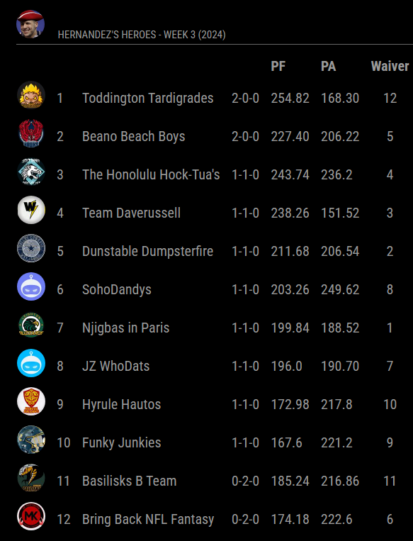

# MMM-SleeperNFLStandings

This is a MagicMirror² module which displays the standings for your NFL Fantasy League on Sleeper.

<p align="center">
 
</p>

## Basic installation

```bash
cd ~/MagicMirror/modules
git clone https://github.com/voldo42/MMM-SleeperNFLStandings
cd MMM-SleeperNFLStandings
npm install
```

## Basic configuration

Add the following code to your ~/MagicMirror/config/config.js:

```js
{
  module: "MMM-SleeperNFLStandings",
  position: "top_left",
  config: {
    leagueId: [yourLeagueId],
				showTableHeaders: false,
				excludeColumns: ["rank", "ptsAgainst", "waiverPosition"]
			}
  }
},
```
